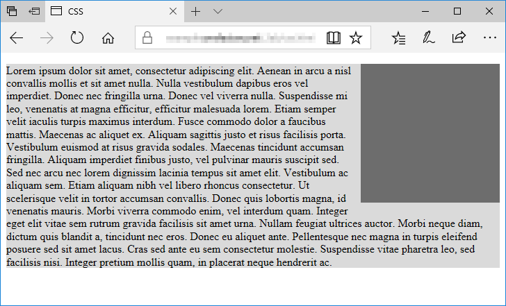
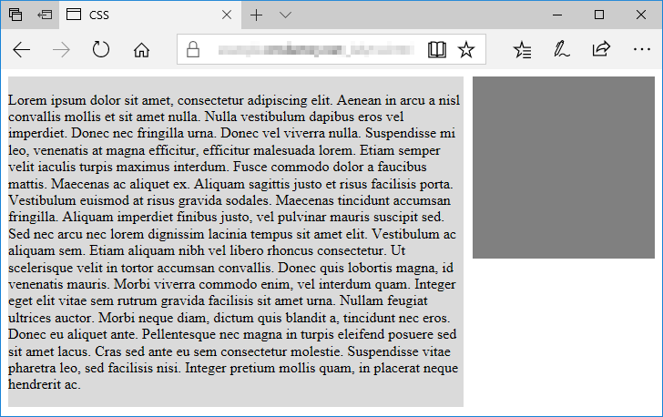

# style을 HTML 페이지에 적용하는 방법 3가지(inline, internal, external)

## Inline Style (인라인 스타일)

HTML 태그의 style 속성에 CSS 코드를 넣는 방법

해당 요소에만 스타일을 적용할 수 있고 비교적 직관적으로 사용이 가능하다.

```jsx
<body>
<h2 style="color:green; text-decoration:underline">

    인라인 스타일을 이용하여 스타일을 적용하였습니다.

</h2>
</body>
```

## Internal Style Sheet (내부 스타일 시트)

HTML 문서 안의 <style>과 </style>안에 CSS코드를 넣는 방법

HTML 문서마다 스타일을 지정해줘야한다. (한 문서에만 해당되는 스타일을 지정할 때 사용하면 좋다)

```jsx
<head>
<style>

    body { background-color: lightyellow; }

    h2 { color: red; text-decoration: underline; }

</style>
</head>
```

## External Style Sheet (외부 스타일 시트)

별도의 CSS 파일을 만들고 HTML 문서와 연결하는 방법

```jsx
<head>
<link rel="stylesheet" href="/examples/media/expand_style.css">
</head>
```

스타일을 적용할 때 웹 페이지의 <head>태그에 <link>태그를 사용하여 외부 스타일 시틀르 포함해야만 스타일이 적용된다.

외부에 작성된 스타일 시트 파일은 .css 확장자를 사용하여 저장된다.

- 장점

홈페이지 전체의 스타일을 일관성있게 유지하면서 변경시에도 일괄적으로 변경할 수 있어서 홈페이지 제작의 효율성이 극대화된다.

- 단점

외부 스타일 시트 파일을 계속적으로 관리해주면서 HTML 문서를 만들어야 한다.

### 스타일 적용의 우선순위

1. Inline Style
    
    → HTML 요소 내부에 위치한다.
    
2. Internal / External Style Sheet
    
    → HTML 문서의 head 요소 내부에 위치한다.
    
3. 웹 브라우저 기본 스타일

# CSS 위치 속성

# display 속성

웹 페이지의 layout을 결정하는 CSS의 속성 중 하나

해당 HTML 요소가 웹 브라우저에 “언제 어떻게 보이는가”를 결정한다.

- block (블록)
    
    display 속성값이 block인 요소는 새로운 line에서 시작하고 해당 라인의 모든 너비를 차지한다.
    
    대표적으로 <div>, <h1>, <p>, <ul>, <ol>, <form>이 있다.
    
- inline (인라인)
    
    display 속성값이 inline인 요소는 새로운 line에서 시작하지 않고 요소의 너비는 해당 HTML 요소의 내용만큼 차지한다.
    
    대표적으로 <span>, <a>, 이 있다
    

HTML의 모든 요소는 각각의 기본 display 속성값을 가지고 있다.

하지만 display 속성값이 block 인 요소의 속성값을 inline 으로 바꿀 수 있고 inline 인 요소의 속성값을 block 으로 바꿀 수도 있다.

- **inline-block (인라인-블록)**
    
    display 속성값이 inline-block으로 설정된 요소는 해당 요소 자체는 inline 요소처럼 동작한다. 하지만 해당 요소 내부에서는 block 요소처럼 동작한다.
    
    - 너비와 높이를 설정할 수 있다.
    - block 요소처럼 margin 을 이용하여 여백을 지정할 수도 있다.

# float 속성

HTML 요소가 주변의 다른 요소들과 자연스럽게 어울리도록 설정한다.

float는 요소를 왼쪽 또는 오른쪽에 배치할 때 유용한 속성이고, float 속성을 부여한 요소의 다음 요소는 float 속성을 부여한 요소가 차지하는 위치만 제외하고 나머지 공간을 채우게 된다.

사진을 왼쪽 또는 오른쪽에 배치하고 그 주위를 텍스트로 채울 때 사용하거나, 사이트 레이아웃을 만들 때 사용한다. (overflow 부분의 첫 번째 사진 참)

display 속성값을 변경해도 실제로 해당 요소가 완전히 다른 타입의 요소로 바뀌는 것은 아님. → display 속성값을 inline에서 block으로 변경해도 변경된 요소는 내부에 다른 요소를 포함할 수 없다. (처음부터 display 속성값이 block인 요소만 내부에 다른 요소를 포함할 수 있기 때문)

**overflow**

→ 내용이 요소의 크기를 벗어났을 때 어떻게 처리할지를 정하는 속성

내용이 주어진 공간에 다 들어가지 않을 때 보여주게 하거나 안 보이게 하거나 스크롤바를 만들게 할 수도 있다.

float와 overflow

→ 

```jsx
<!doctype html>
<**html** lang="ko">
	<**head**>
		<**meta** charset="utf-8">
		<**title**>CSS</**title**>
		<**style**>
		.a {
			float: right;
			width: 200px;
			height: 200px;
			background-color: rgba( 0,0,0,0.5);
			margin: 0px 0px 10px 10px;
		}
		.b {
			background-color: #dadada;
		}
	</**style**>
</**head**>

<**body**>
		<**div** class="a"></**div**>
		<**div** class="b">
			<**p**>Lorem ipsum dolor sit amet, consectetur adipiscing elit. Aenean in arcu a nisl convallis mollis et sit amet nulla. Nulla vestibulum dapibus eros vel imperdiet. Donec nec fringilla urna. Donec vel viverra nulla. Suspendisse mi leo, venenatis at magna efficitur, efficitur malesuada lorem. Etiam semper velit iaculis turpis maximus interdum. Fusce commodo dolor a faucibus mattis. Maecenas ac aliquet ex. Aliquam sagittis justo et risus facilisis porta. Vestibulum euismod at risus gravida sodales. Maecenas tincidunt accumsan fringilla. Aliquam imperdiet finibus justo, vel pulvinar mauris suscipit sed. Sed nec arcu nec lorem dignissim lacinia tempus sit amet elit. Vestibulum ac aliquam sem. Etiam aliquam nibh vel libero rhoncus consectetur. Ut scelerisque velit in tortor accumsan convallis. Donec quis lobortis magna, id venenatis mauris. Morbi viverra commodo enim, vel interdum quam. Integer eget elit vitae sem rutrum gravida facilisis sit amet urna. Nullam feugiat ultrices auctor. Morbi neque diam, dictum quis blandit a, tincidunt nec eros. Donec eu aliquet ante. Pellentesque nec magna in turpis eleifend posuere sed sit amet lacus. Cras sed ante eu sem consectetur molestie. Suspendisse vitae pharetra leo, sed facilisis nisi. Integer pretium mollis quam, in placerat neque hendrerit ac.</**p**>
		</**div**>
	</**body**>
</**html**>
```



```jsx
**.b** {
	background-color: **#dadada**;
	overflow: auto;
}
```



→ float 속성만 있을 때와 달리 박스 주위에 배열된 텍스트가 정렬되었다.

# position 속성

position 속성은 HTML 요소가 위치를 결정하는 방식을 설정한다.

### CSS에서 요소의 위치를 결정하는 방법 4가지 (static, relative, fixed, absolute)

1. 정적위치 (static position) 지정 방식
    
    static positon 지정 방식은 웹페이지의 흐름에 따라 차례대로 요소들을 위치시키는 방식이다.
    
    ```jsx
    <style>
    	div { position: static; }
    </style>
    ```
    
    +모든 HTML 요소의 position 속성의 기본 설정값은 static 이다. 
    
2. 상대 위치 (relative position) 지정 방식
    
    relative position 지정 방식은 해당 HTML 요소의 기본 위치를 기준으로 위치를 설정하는 방식이다.
    
    HTML 요소의 기본 위치란 해당 요소가 static position 지정 방식일 때 결정되는 위치를 말한다.
    
    ```jsx
    <style>
    	div.relative { position: relative; left: **30px**; }
    </style>
    ```
    
3. 고정 위치 (fixed position) 지정 방식
    
    fixed position 지정 방식은 viewport (뷰포트)를 기준으로 위치를 설정하는 방식이다. 
    
    웹 페이지가 스크롤 되어도 고정 위치로 지정된 요소는 항상 같은 곳에 위치한다.
    
    ```jsx
    <style>
    	div.fixed { position: fixed; top: **0**; right: **0**; }
    </style>
    ```
    
4. 절대 위치 (absolute position) 지정 방식
    
    absolute position 지정 방식은 fixed position이 viewport (뷰포트)를 기준으로 위치를 결정하는 것과 비슷하게 동작함.
    
    위치가 설정된 ancestor 요소를 기준으로 위치를 설정한다.
    
    그런데 위치가 설정된 ancestor 요소를 가지지 않는다면, HTML 문서의 body 요소를 기준으로 위치를 설정한다.
    
    위치가 설정된 요소는 static position 지정 방식을 제외한 다른 방식(relative, fixed, absolute)으로 위치가 설정된 요소를 말한다.
    

**z-index 속성**

HTML 요소의 위치를 설정하게 되면 설정된 위치 및 방식에 따라 서로 겹칠 수도 있는데 z-index 속성은 겹쳐지는 요소들이 쌓이는 stack의 순서를 설정한다.

```jsx
<style>
	.last {
		position: fixed;
		top: **180px**;
		left: **120px**;
		z-index: **-1**;
	}
</style>
```

position : HTML 요소의 위치를 결정하는 방식을 설정한다.

top : 위치가 설정된 ancestor 요소의 위로부터의 여백을 설정한다.

right : 위치가 설정된 ancestor 요소의 오른쪽으로부터의 여백을 설정한다.

bottom : 위치가 설정된 ancestor 요소의 아래로부터의 여백을 설정한다.

left  : 위치가 설정된 ancestor 요소의 왼쪽으로부터의 여백을 설정한다.

clip : abslotue position (절대위치) 지정 방식으로 위치한 요소를 자른다.

cursor : 표시되는 마우스 커서의 모양을 설정한다.

overflow : content의 크기가 해당 요소의 box를 넘어갈 때 어떻게 처리할지를 설정한다.

overflow-x : content의 크기가 해당 요소의 수평 방향으로 box를 넘어갈 때 어떻게 처리할지를 설정한다.

overflow-y : content의 크기가 해당 요소의 수직 방향으로 box를 넘어갈 때 어떻게 처리할지를 설정한다.

# CSS **Flex**

flex는 레이아웃 배치 전용 기능으로 각 요소의 크기가 불분명하거나 동적인 경우에도 각 요소를 정렬할 수 있는 방법을 제공한다.

flex는 container와 items로 나뉜다.

→ container는 items를 감싸는 부모요소이고, item을 정렬하기 위해서는 container가 필수다.


container와 items에 적용하는 속성은 그림과 같이 구분되어 있다.

- **display: flex;**
    
    ```jsx
    .container {
    		display: flex;
    	}
    ```
    
    flex의 items들은 가로 방향으로 배치되고, width는 자신이 가진 내용물의 width만큼, height는 container의 height만큼 차지한다.
    

- **flex-direction (배치 방향 설정)**
    
    items이 배치되는 축의 방향을 결정하는 속성
    
    ```jsx
    .container {
    		flex-direction: row;
    		/* flex-direction: column; */
    		/* flex-direction: row-reverse; */
    		/* flex-direction: column-reverse; */
    	}
    ```
    
- **flex-wrap (줄넘김 처리 설정)**
    
    container에 items를 한 줄에 담을 여유 공간이 없을 때, items 줄바꿈을 어떻게 할지 결정하는 속성
    
    ```jsx
    .container {
    		flex-wrap: nowrap;
    		/* flex-wrap: wrap; */
    		/* flex-wrap: wrap-reverse; */
    	}
    ```
    
- **flex-flow (flex-direction과 flex-wrap을 한꺼번에 지정할 수 있는 단축 속성)**
    
    flex-direction, flex-wrap의 순으로 한 칸 띄우고 쓰면 된다.
    
    ```jsx
    .container {
    		flex-flow: row wrap;
    	}
    ```
    

**justify와 align**

justify : main axis (메인축) 방향으로 정렬

align : cross axis (수직축) 방향으로 정렬

- **justify-content (메인축 방향 정렬)**
    
    main axis (메인축) 방향으로 items 정렬하는 속성
    
    ```jsx
    .container {
    		justify-content: flex-start;
    		/* justify-content: flex-end; */
    		/* justify-content: center; */
    		/* justify-content: space-between; */
    		/* justify-content: space-around; */
    		/* justify-content: space-evenly; */
    	}
    ```
    
- **align-items (수직축 방향 정렬)**
    
    cross axis (수직축) 방향으로 items 정렬하는 속성
    
    ```jsx
    .container {
    		align-items: stretch;
    		/* align-items: flex-start; */
    		/* align-items: flex-end; */
    		/* align-items: center; */
    		/* align-items: baseline; */
    	}
    ```
    
- **align-content (여러 행 정렬)**
    
    flex-wrap: wrap; 이 설정된 상태에서 items 의 행이 2줄 이상 되었을 때의 corss axis (수직축) 방향 정렬을 결정하는 속성
    
    ```jsx
    .container {
    		flex-wrap: wrap;
    
    		align-content: stretch;
    		/* align-content: flex-start; */
    		/* align-content: flex-end; */
    		/* align-content: center; */
    		/* align-content: space-between; */
    		/* align-content: space-around; */
    		/* align-content: space-evenly; */
    }
    ```
