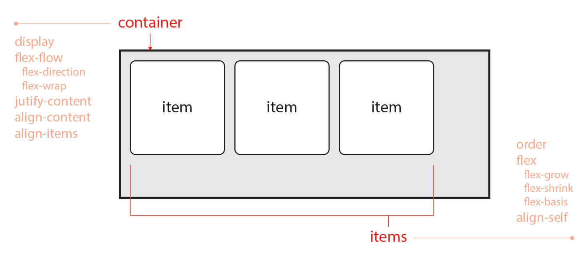

# **Flex**

flex는 레이아웃 배치 전용 기능으로 각 요소의 크기가 불분명하거나 동적인 경우에도 각 요소를 정렬할 수 있는 방법을 제공한다.

flex는 container와 items로 나뉜다.

→ container는 items를 감싸는 부모요소이고, item을 정렬하기 위해서는 container가 필수다.



container와 items에 적용하는 속성은 그림과 같이 구분되어 있다.

- **display: flex;**
    
    ```jsx
    .container {
    		display: flex;
    	}
    ```
    
    flex의 items들은 가로 방향으로 배치되고, width는 자신이 가진 내용물의 width만큼, height는 container의 height만큼 차지한다.
    

- **flex-direction (배치 방향 설정)**
    
    items이 배치되는 축의 방향을 결정하는 속성
    
    ```jsx
    .container {
    		flex-direction: row;
    		/* flex-direction: column; */
    		/* flex-direction: row-reverse; */
    		/* flex-direction: column-reverse; */
    	}
    ```
    
- **flex-wrap (줄넘김 처리 설정)**
    
    container에 items를 한 줄에 담을 여유 공간이 없을 때, items 줄바꿈을 어떻게 할지 결정하는 속성
    
    ```jsx
    .container {
    		flex-wrap: nowrap;
    		/* flex-wrap: wrap; */
    		/* flex-wrap: wrap-reverse; */
    	}
    ```
    
- **flex-flow (flex-direction과 flex-wrap을 한꺼번에 지정할 수 있는 단축 속성)**
    
    flex-direction, flex-wrap의 순으로 한 칸 띄우고 쓰면 된다.
    
    ```jsx
    .container {
    		flex-flow: row wrap;
    	}
    ```
    

**justify와 align**

justify : main axis (메인축) 방향으로 정렬

align : cross axis (수직축) 방향으로 정렬

- **justify-content (메인축 방향 정렬)**
    
    main axis (메인축) 방향으로 items 정렬하는 속성
    
    ```jsx
    .container {
    		justify-content: flex-start;
    		/* justify-content: flex-end; */
    		/* justify-content: center; */
    		/* justify-content: space-between; */
    		/* justify-content: space-around; */
    		/* justify-content: space-evenly; */
    	}
    ```
    
- **align-items (수직축 방향 정렬)**
    
    cross axis (수직축) 방향으로 items 정렬하는 속성
    
    ```jsx
    .container {
    		align-items: stretch;
    		/* align-items: flex-start; */
    		/* align-items: flex-end; */
    		/* align-items: center; */
    		/* align-items: baseline; */
    	}
    ```
    
- **align-content (여러 행 정렬)**
    
    flex-wrap: wrap; 이 설정된 상태에서 items 의 행이 2줄 이상 되었을 때의 corss axis (수직축) 방향 정렬을 결정하는 속성
    
    ```jsx
    .container {
    		flex-wrap: wrap;
    
    		align-content: stretch;
    		/* align-content: flex-start; */
    		/* align-content: flex-end; */
    		/* align-content: center; */
    		/* align-content: space-between; */
    		/* align-content: space-around; */
    		/* align-content: space-evenly; */
    }
    ```
